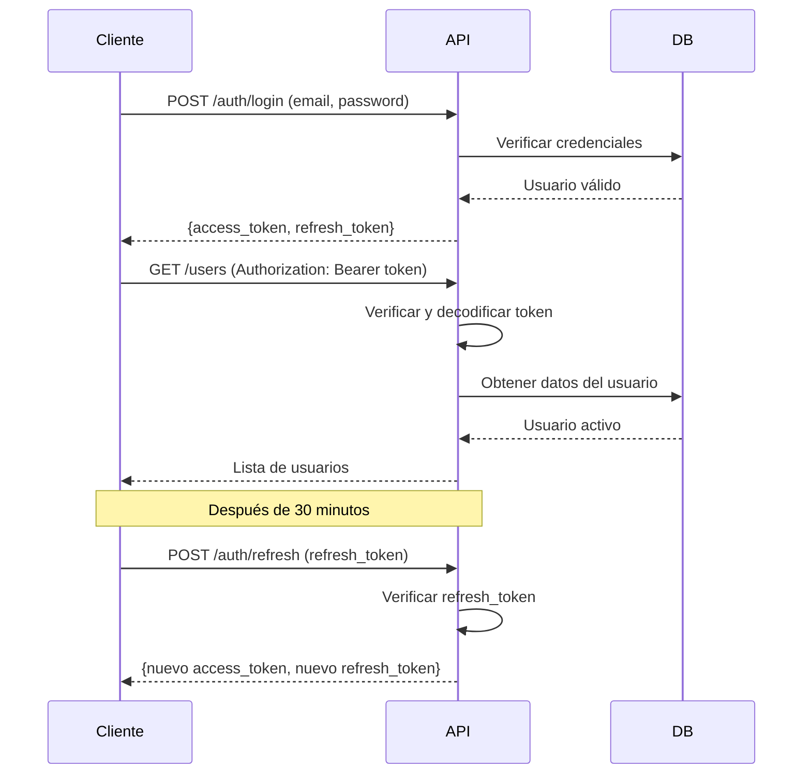

# 🔐 Guía de Pruebas Manuales - Autenticación JWT

Esta guía muestra cómo probar manualmente los endpoints de autenticación usando `curl`.

## 📋 Credenciales de Prueba

```
Email: demo@nestsecure.com
Password: Demo123!
```

## 🚀 Ejemplos de Uso con curl

### 1. Login - Obtener Token

#### Opción A: Login con formulario OAuth2 (recomendado)

```bash
curl -X POST "http://localhost:8000/api/v1/auth/login" \
  -H "Content-Type: application/x-www-form-urlencoded" \
  -d "username=demo@nestsecure.com&password=Demo123!"
```

**Respuesta:**
```json
{
  "access_token": "eyJhbGciOiJIUzI1NiIsInR5cCI6IkpXVCJ9...",
  "refresh_token": "eyJhbGciOiJIUzI1NiIsInR5cCI6IkpXVCJ9...",
  "token_type": "bearer",
  "expires_in": 1800,
  "user": {
    "id": "fc83f443-1749-4a7c-b66b-8029ec95148d",
    "email": "demo@nestsecure.com",
    "full_name": "Demo User",
    "role": "admin",
    "organization_id": "589ce537-e6d9-4dfa-88a8-5d8eb6c4eba3",
    "is_active": true,
    "is_superuser": false
  }
}
```

#### Opción B: Login con JSON

```bash
curl -X POST "http://localhost:8000/api/v1/auth/login/json" \
  -H "Content-Type: application/json" \
  -d '{
    "email": "demo@nestsecure.com",
    "password": "Demo123!"
  }'
```

### 2. Usar Token para Acceder a Endpoints Protegidos

Una vez que tienes el `access_token`, debes incluirlo en el header `Authorization` con el formato `Bearer <token>`.

#### Obtener tu perfil

```bash
TOKEN="eyJhbGciOiJIUzI1NiIsInR5cCI6IkpXVCJ9..."

curl -X GET "http://localhost:8000/api/v1/auth/me" \
  -H "Authorization: Bearer $TOKEN"
```

**Respuesta:**
```json
{
  "id": "fc83f443-1749-4a7c-b66b-8029ec95148d",
  "email": "demo@nestsecure.com",
  "full_name": "Demo User",
  "role": "admin",
  "organization_id": "589ce537-e6d9-4dfa-88a8-5d8eb6c4eba3",
  "is_active": true,
  "is_superuser": false,
  "last_login_at": "2026-01-29T20:08:42.414126Z",
  "avatar_url": null,
  "organization": {
    "id": "589ce537-e6d9-4dfa-88a8-5d8eb6c4eba3",
    "name": "Demo Organization",
    "slug": "demo-org"
  }
}
```

#### Listar usuarios (requiere rol ADMIN)

```bash
curl -X GET "http://localhost:8000/api/v1/users" \
  -H "Authorization: Bearer $TOKEN"
```

### 3. Refrescar Token

Cuando tu `access_token` expire (30 minutos), puedes usar el `refresh_token` para obtener uno nuevo sin volver a hacer login:

```bash
REFRESH_TOKEN="eyJhbGciOiJIUzI1NiIsInR5cCI6IkpXVCJ9..."

curl -X POST "http://localhost:8000/api/v1/auth/refresh" \
  -H "Content-Type: application/json" \
  -d "{\"refresh_token\":\"$REFRESH_TOKEN\"}"
```

**Respuesta:**
```json
{
  "access_token": "eyJhbGciOiJIUzI1NiIsInR5cCI6IkpXVCJ9...",
  "refresh_token": "eyJhbGciOiJIUzI1NiIsInR5cCI6IkpXVCJ9...",
  "token_type": "bearer",
  "expires_in": 1800
}
```

### 4. Validar Token

```bash
curl -X POST "http://localhost:8000/api/v1/auth/test-token" \
  -H "Authorization: Bearer $TOKEN"
```

## 🎯 Script Automatizado

Hemos creado un script que ejecuta todas las pruebas automáticamente:

```bash
./backend/scripts/test_auth_manual.sh
```

Este script:
1. ✅ Login con OAuth2
2. ✅ Login con JSON
3. ✅ Obtiene perfil con token
4. ✅ Intenta acceder sin token (debería fallar)
5. ✅ Lista usuarios con autenticación
6. ✅ Refresca el token
7. ✅ Usa el nuevo token
8. ✅ Valida el token

## 📝 Crear Nuevo Usuario Demo

Si necesitas crear otro usuario de prueba:

```bash
docker exec nestsecure_backend_dev python3 /app/scripts/create_demo.py
```

Este script:
- Crea una organización "Demo Organization"
- Crea un usuario admin demo@nestsecure.com
- Password: Demo123!

## 🔍 Verificar Estado del Servidor

```bash
curl http://localhost:8000/health
```

## 🛠️ Endpoints Disponibles

### Autenticación
- `POST /api/v1/auth/login` - Login con formulario OAuth2
- `POST /api/v1/auth/login/json` - Login con JSON
- `POST /api/v1/auth/refresh` - Refrescar token
- `GET /api/v1/auth/me` - Obtener perfil del usuario actual
- `POST /api/v1/auth/test-token` - Validar token

### Usuarios (requiere autenticación)
- `GET /api/v1/users` - Listar usuarios
- `POST /api/v1/users` - Crear usuario (ADMIN)
- `GET /api/v1/users/{id}` - Obtener usuario
- `PUT /api/v1/users/{id}` - Actualizar usuario
- `DELETE /api/v1/users/{id}` - Eliminar usuario (ADMIN)

### Organizaciones (requiere autenticación)
- `GET /api/v1/organizations` - Listar organizaciones
- `POST /api/v1/organizations` - Crear organización (ADMIN)
- `GET /api/v1/organizations/{id}` - Obtener organización
- `PUT /api/v1/organizations/{id}` - Actualizar organización (ADMIN)
- `DELETE /api/v1/organizations/{id}` - Eliminar organización (ADMIN)

## ⚙️ Configuración JWT

- **Access Token**: Expira en 30 minutos
- **Refresh Token**: Expira en 7 días
- **Algorithm**: HS256
- **Header Format**: `Authorization: Bearer <token>`

## 🚨 Errores Comunes

### 401 Unauthorized
```json
{"detail": "Not authenticated"}
```
**Solución**: Verifica que estés incluyendo el header `Authorization: Bearer <token>`

### 403 Forbidden
```json
{"detail": "No tienes permisos para realizar esta acción"}
```
**Solución**: Tu usuario no tiene los permisos necesarios (ej: necesitas rol ADMIN)

### 422 Validation Error
```json
{"detail": [...]}
```
**Solución**: Verifica que los datos enviados cumplan con el esquema requerido

## 🎓 Flujo de Autenticación Completo



## ✅ Verificación Exitosa

Si todos los tests pasan, deberías ver:

```
========================================
   ✓ Todas las pruebas completadas
========================================
```

Esto confirma que:
- ✅ JWT está funcionando correctamente
- ✅ Los tokens se generan y validan
- ✅ Los endpoints protegidos requieren autenticación
- ✅ El refresh token funciona
- ✅ Los roles y permisos se aplican correctamente
